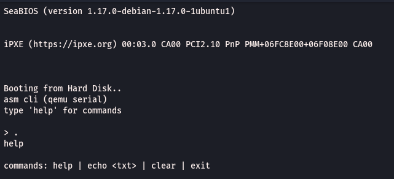

# asmcli

Tiny CLI written in x86 assembly, running bare-metal in QEMU and interactable via the serial console.



## Requirements

- `nasm`
- `qemu-system-x86_64`

## How to run

```sh
make run
```

This builds `asmcli.img` (if needed) and boots it in QEMU with `-nographic`, so your terminal **is** the serial console. You should see:

```
asm cli (qemu serial)
type 'help' for commands
>
```

Available commands:

| Command      | Effect                                              |
|--------------|-----------------------------------------------------|
| `help`       | List commands                                       |
| `echo <txt>` | Print `<txt>` back                                  |
| `clear`      | Clear screen (ANSI escape sequence)                 |
| `exit`       | Print `bye` and shut QEMU down, returning your shell |

Notes:

- In `-nographic` mode the serial line is multiplexed with the QEMU monitor: `Ctrl-A X` quits QEMU, `Ctrl-A C` enters the QEMU monitor.
- Typing `exit` powers the VM off via the `isa-debug-exit` device, so control returns to your terminal automatically.
- Non-interactive smoke test: `make test` (pipes a scripted session into QEMU).
- Alternative display frontend: `make run-curses`.

## Files

| File        | Summary                                                                                           |
|-------------|---------------------------------------------------------------------------------------------------|
| `boot.asm`  | 512-byte boot sector. Inits COM1 (115200 8N1), loads 63 sectors via BIOS `int 13h` to `0x7E00`, jumps to the kernel. |
| `kernel.asm`| 16-bit bare-metal CLI kernel (`ORG 0x7E00`). Polled COM1 (`0x3F8`) I/O, line input with echo/backspace, `help`/`echo`/`clear`/`exit` dispatch, serial flush + `isa-debug-exit` / ACPI / 8042 shutdown chain on `exit`. |
| `cli.asm`   | Legacy Linux userspace version of the CLI (64-bit ELF, `syscall` based). Not used for QEMU; kept for reference. |
| `Makefile`  | Builds `boot.bin` + `kernel.bin` with NASM into bootable `asmcli.img`; targets `run`, `run-curses`, `test`, legacy `cli`, `clean`. |
